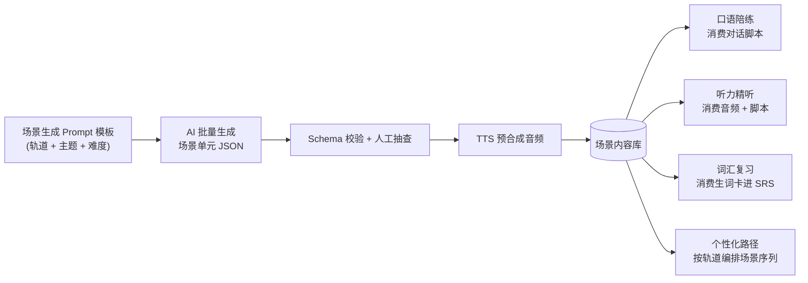
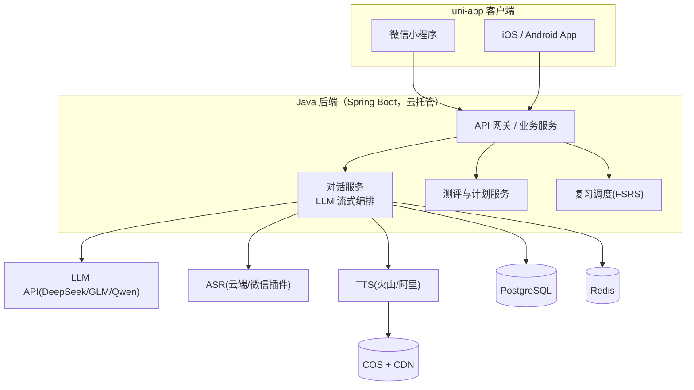

# 产品设计文档 · 英语学习小程序 + App

- 版本：v0.3（MVP 已实现，见 §13 实现状态）
- 日期：2026-08-29
- 状态：MVP 代码完成并通过端到端验证；待确认产品名后进入打磨
- 投入模式：个人副业 / 独立开发，每周约 10–15 小时

## 0. 已对齐的决策

| 决策点 | 结论 |
| --- | --- |
| 目标用户 | 全人群入口，用户自选目标后分流内容（轨道制） |
| 核心能力 | AI 口语陪练 + 词汇复习 + 听力精听 + 个性化路径，全部纳入，分阶段交付 |
| 技术路线 | 一套代码多端：uni-app → 微信小程序 + iOS / Android |
| 后端 | Java 21 + Spring Boot 3（明确不使用 Node.js） |
| 变现预期 | 轻变现：免费额度 + 订阅，不做广告 |

> 设计总原则：个人开发者最大的风险不是功能不够，而是「全都要」导致永远上不了线。本文档把「全能力、全人群」翻译成——**一个内容引擎 + 分轨道 + 分阶段交付**。

## 1. 一句话定位

**「按你的目标定制的 AI 英语陪练」**：入学三问 + 测评定级 → 生成专属学习轨道 → 每天 10–15 分钟，在真实场景里听、说、记、复习。

差异化不押在某个单点功能上，而是：**内容按「你的目标场景」组织，且由 AI 低成本持续生成**。

## 2. 核心设计思想：一个内容引擎，四个练习面

传统做法里，口语 / 听力 / 单词 / 课程是四套内容成本，个人开发者做不动。本产品的做法是把所有练习面统一到一个最小内容单元——**场景单元（Scenario Unit）**：



一个场景单元包含：

1. 场景元信息：轨道、主题、难度（CEFR A1–C1）、角色设定
2. 对话脚本：6–12 轮，标注目标语言点（口语陪练的底稿）
3. 音频：逐句 TTS 预合成（听力精听与跟读的素材）
4. 生词卡：3–8 个（词、音标、释义、例句、发音）
5. 练习题：理解题、跟读句、填空

四个功能面只是同一份内容的不同「皮肤」：

- **口语陪练**：消费对话脚本做角色扮演 + 实时 AI 对话
- **听力精听**：消费音频 + 脚本做逐句盲听 / 跟读
- **词汇复习**：消费生词卡进入 SRS 调度
- **个性化路径**：按轨道 + 难度把场景编排成课程表

新增一个场景 = 跑一遍批量 prompt + 半小时抽查，边际成本趋近于零。这就是独立开发者能「全能力」的前提。

## 3. 用户与轨道

### 3.1 入口：Onboarding 三问

1. **你的目标？** 日常交流 / 职场工作 / 出国旅行 / 考试备考（四六级·雅思·托福）/ 兴趣提升
2. **当前水平？** 自评 + 10 题快速测评校准（见 §4.1）
3. **每天能投入？** 5 / 15 / 30 分钟 → 决定每日任务量

### 3.2 轨道规划

| 轨道 | 阶段 | 内容来源 | 说明 |
| --- | --- | --- | --- |
| 日常交流 | MVP | AI 生成场景（点单、问路、聊爱好…） | 默认轨道 |
| 职场口语 | MVP | AI 生成（会议、追进度、面试…） | 第二轨道，付费意愿最强 |
| 出国旅行 | V1.5 | AI 生成 | 与日常轨道复用度高 |
| 考试备考 | V2 | 核心词表 + AI 生成情景 | 词汇优先；真题有版权风险，不做题库 |
| 少儿/亲子 | 暂缓 | — | 合规与内容成本高，单独立项评估（§10.5） |

### 3.3 用户画像（首批内测对象）

| 画像 | 痛点 | 场景 |
| --- | --- | --- |
| 小林，27，互联网运营 | 开会不敢用英语发言，怕出丑 | 通勤 15 分钟，职场轨道，练「表达意见」「追问细节」 |
| 王芳，33，外贸跟单 | 要接客户电话，听力跟不上、回话慢 | 晚上半小时，练「电话沟通」「报价谈判」，依赖复盘和生词复习 |

## 4. 功能设计

### 4.1 测评定级与每日计划（个性化路径）

- **入学测评（约 3 分钟）**：10 题自适应（词汇 + 听力辨句）+ 30 秒口语自述（ASR 转写后由 LLM 粗评），输出 CEFR 映射等级（A1–C1）与薄弱项标签
- **每日三件事**：按 daily_minutes 生成，例如 15 分钟 = 复习 15 词（4 分钟）+ 学一个场景（5 分钟）+ 对话实战 3 轮（6 分钟）
- **动态调整**：连续 3 天完成度高 → 推进难度；连续缺勤 → 降任务量保 streak（留存优先于进度）

### 4.2 AI 口语陪练（主打卖点）

- **场景大厅**：按轨道分组的场景卡（今天推荐置顶）
- **对话页**：按住说话 → 识别 → AI 流式回复（文本 + 语音），支持打字兜底
- **实时反馈三件套**（不打断对话节奏，以小卡片呈现）：
  - 发音反馈：ASR 文本比对 + 整句评分，逐词着色（V1 接专业评测引擎）
  - 更地道的说法：「你说的 OK，母语者更常说…」
  - 语法纠错：说错后折叠小卡片，点开看修正
- **对话后复盘页**：本轮对话回放、生词一键入库、AI 教练点评（3 条优点 + 2 条建议）
- **关键体验指标**：AI 语音回复首响 < 2 秒（流式文本 + 首句先行合成，见 §7.2）

### 4.3 词汇与 SRS 复习

- **生词本四个来源**：对话中收藏 / 听力点词 / 每日推荐 / 测评建议词表
- **调度算法**：FSRS（开源算法，ts-fsrs 现成实现），按记忆遗忘曲线排期
- **复习形式 4 种**：中英辨词、听音辨词、例句填空、口语造句（最后一种回灌到口语面）
- 每日复习量与免费额度挂钩（商业化卡点，见 §8）

### 4.4 听力精听

- **三步精听**：整段盲听 → 逐句字幕 + 点词收藏 → 跟读评分
- **素材**：MVP 直接复用场景音频；V1.5 接入免版权素材（VOA、LibriVox 类）+ AI 生成的情景短文
- 不单独占 Tab，从「今天」的每日计划与「我的-素材库」进入（§5）

### 4.5 打卡与激励

- streak 火焰、学习时长与词汇曲线、每周学习报告（学了什么、敢说了几句、生词掌握率）
- V2：同桌 / 小组机制（弱社交，避免重运营负担）

## 5. 信息架构（底部 4 Tab）

| Tab | 名称 | 承载内容 |
| --- | --- | --- |
| 1 | 今天 | 每日三件事、streak、场景推荐、快速进入话 |
| 2 | 练口语 | 场景大厅、对话历史、复盘入口 |
| 3 | 词库 | 生词本、复习入口、词书（V2） |
| 4 | 我的 | 等级报告、学习统计、精听素材库、订阅、设置 |

- 新用户流：Onboarding（3 页）→ 测评（10 题 + 1 段口述）→ 生成专属计划 → 落到「今天」
- 原则：每个 Tab 一个主目标；精听、报告等作为计划内的任务入口，不铺第二套主视图

## 6. MVP 边界（关键章节）

**MVP 必须（小程序先行，约 8 周业余时间）：**

- Onboarding + 测评定级
- 日常 + 职场两轨道，场景 ≥ 40 个（AI 批量生成 + 人工抽查）
- AI 对话：文字 + 语音（按住说话），流式回复，基础纠错与地道说法建议
- 生词本 + FSRS 复习
- 打卡 + 学习统计
- 极简内容管理（先用 SQL / 简单 admin 页审核场景）

**MVP 明确不做：**

| 功能 | 延后到 | 理由 |
| --- | --- | --- |
| 专业发音逐词评测 | V1 | 先用 ASR 文本比对粗评，省接入成本 |
| 听力精听独立模块 | V1.5 | 场景音频已覆盖部分听力价值 |
| iOS / Android App | V1 | 同一代码库，加端适配与原生插件即可 |
| 订阅支付 | V1 | 先积累内测用户与口碑 |
| 社区 / 排行 / 词书市场 | V2 | 重运营，MVP 不碰 |
| 考试轨道 / 少儿轨道 | V2 / 暂缓 | 见 §3.2、§10.5 |

## 7. 技术架构

### 7.1 选型总览

| 层 | 选型 | 理由 |
| --- | --- | --- |
| 客户端 | uni-app（Vue 3 + TS + Vite + Pinia） | 一套代码出微信小程序 + iOS/Android；原生插件市场成熟（录音、评测 SDK） |
| UI 组件 | wot-design-uni（或 uv-ui） | 活跃维护、风格现代 |
| 后端 | Java 21 + Spring Boot 3 + MyBatis-Plus | 虚拟线程承载 SSE 流式并发；WxJava 封装微信登录/支付生态最全；国内资料与招聘面最广 |
| 存储 | PostgreSQL + Redis | 主存储；会话缓存 / 限流 / 额度计数 |
| 文件 | 腾讯云 COS + CDN | TTS 音频预合成与缓存 |
| 部署 | 微信云托管（首选）或轻量服务器 + Docker | 免运维、与微信生态打通；后期可迁移 |
| LLM | DeepSeek / GLM / Qwen | 便宜、流式、function calling；MVP 实现为自研轻量 OpenAI 兼容客户端（JDK HttpClient，无额外依赖），换模型只改配置，后续可替换 Spring AI |
| ASR | 微信同声传译插件（小程序兜底）+ 云端 ASR（火山 / 阿里） | 成本与效果均衡，统一走服务端 |
| TTS | 火山引擎 / 阿里 CosyVoice | 自然度高、单价低，固定一个「陪练音色」 |
| 发音评测 | 腾讯云智聆口语评测 / 讯飞语音评测 | V1 接入，按次计费 |



### 7.2 语音对话链路（核心链路）

时序：按住说话 → 录音（16k mp3/aac 压缩上行）→ 服务端 ASR → LLM 流式生成 → **文本边生成边下发**；服务端把 AI 回复按句切分，**首句先送 TTS**，音频就绪即回传，客户端边下边播 → 对话结束后展示反馈卡片。

工程约束：

- 流式推送用 SseEmitter + Java 21 虚拟线程（`spring.threads.virtual.enabled=true`），按传统 Servlet 栈写流式，全站不必引入 WebFlux
- AI 回复限长 ≤ 2 句/轮（口语对话节奏，也压 token 成本）
- 高频场景的常见问答回复做缓存
- 小程序端录音/播放用同一套抽象层，App 端替换原生插件实现

### 7.3 AI 内容流水线（离线批量）

1. Prompt 模板（轨道 + 主题 + CEFR 等级 + 角色设定）→ 批量生成场景 JSON
2. Schema 自动校验（对话轮数、生词数、字段完整性）→ 不合格自动重试
3. 人工抽查（目标 10% 抽检率）
4. TTS 预合成逐句音频 → 入库

冷启动量：40 个场景 × 2 轨道 ≈ 一次批量任务 + 半天人工抽查，成本几块钱以内。

### 7.4 数据模型（核心表）

```sql
users(id, wx_openid, unionid, phone, created_at)
user_profiles(user_id, goal_track, cefr_level, daily_minutes,
              streak_days, last_study_date)
scenarios(id, track, topic, cefr, title_zh, title_en,
          role_setting, status)            -- status: draft/published
scenario_lines(id, scenario_id, idx, speaker, en, zh, audio_url)
scenario_vocab(id, scenario_id, word, phonetic, meaning_zh,
               example_en, example_zh, audio_url)
conversations(id, user_id, scenario_id, started_at, ended_at, ai_summary)
messages(id, conversation_id, idx, role, content, audio_url, feedback_json)
vocab_entries(id, user_id, word, source, fsrs_state, due_at, added_at)
review_logs(id, user_id, vocab_id, rating, reviewed_at)
study_logs(id, user_id, date, minutes, words_reviewed, dialogs_done)
subscriptions(id, user_id, plan, channel, starts_at, expires_at, status)
```

### 7.5 单用户成本粗算（每日 15 分钟）

| 项 | 量 | 成本量级 |
| --- | --- | --- |
| LLM 对话 | 3 个场景 × ~20 轮消息 | 每天几分钱 |
| ASR + TTS | 约 10 分钟语音 | 0.1–0.3 元/天 |
| 内容生成 | 离线批量 + 缓存 | 摊销可忽略 |

月活跃用户成本约 3–9 元 → 需用「免费额度 + 回复限长 + 内容预生成 + 分级模型」把免费用户日均成本压到 0.2 元以内，订阅价（¥18/月）才能覆盖并留出毛利。

## 8. 商业化

| 层 | 内容 | 价格 |
| --- | --- | --- |
| 免费 | 每日 10 轮 AI 对话、30 词复习、打卡与统计 | 0 |
| 会员 | 无限对话、发音评测报告、精听模块、周报、专属场景 | 连续包月 ¥18 / 年 ¥128 |

- 小程序走微信支付；iOS App 内虚拟权益**必须走苹果 IAP**（价格上浮或弱化 App 内购买引导——注意「引导外部支付」有审核风险，文案需谨慎）
- MVP 阶段不上支付，先验证留存

## 9. 产品命名候选（待定）

命名原则：① 小程序名全网唯一、两三个字好记 ② 带「英语 / 口语 / 说」等词利于微信搜一搜 ③ 商标 9 / 41 / 42 类可注册 ④ 域名可配（.com / .cn / .app）

| 候选 | 释义 | 风格 |
| --- | --- | --- |
| 拾语 | 拾起一门语言；谐音「十语」 | 文艺克制 |
| 语芽 | 语言像芽一样生长，契合打卡成长曲线 | 温暖治愈 |
| 开口练 | 直白点题，搜一搜友好 | 直给 |
| 敢说 | 直击「不敢开口」核心痛点 | 态度型 |
| 口语搭子 | 「搭子」语感年轻，AI 陪练定位自解释 | 网感 |
| 语伴 LingPal | AI 陪练 = 学习伙伴 | 功能型 |
| 回声说 EchoSay | 听见自己、纠正自己（跟读回声概念） | 概念型 |
| 麦麦口语 | 拟声「麦克风」，拟人化 IP 空间大 | 活泼 |

**Top 3 推荐**：`口语搭子`（定位自解释、传播成本低）、`开口练`（搜索流量最好）、`拾语`（品牌感最强，适合做长远）。

落地检查清单：微信平台小程序名查重 → 中国商标网 41/42/9 类检索 → 域名可注册性 → 应用商店重名检查。

## 10. 合规与风险（个人开发者重点）

1. **主体**：个人主体小程序不能开通微信支付、可选类目少。建议注册**个体工商户**（成本低），一次性解决支付与类目两个问题；认真做再升级公司主体。
2. **类目**：教育类目对主体与资质有要求（K12 最严），成人语言学习相对宽松；以微信最新类目规则为准，兜底走「工具」类目。
3. **备案**：小程序上线前必须完成小程序 ICP 备案；域名备案；App 上架需软件著作权 + 各商店备案。
4. **AIGC 合规**：《人工智能生成合成内容标识办法》已于 2025-09 施行，AI 生成内容需加显式/隐式标识——对话页与音频需标注「AI 生成」；优先使用已备案的大模型 / TTS 大厂服务，降低自身备案负担。
5. **未成年人**：暂不做少儿轨道的直接原因——未成年人保护模式、内容审查、家长协议的成本都远超个人开发者承受力；未来做需单独设计与评估。
6. **隐私**：录音与语音转写属个人信息，需隐私政策 + 单独同意 + 最小化存储（音频默认 N 天后删除）。
7. **风险排序**：① 范围失控做不完 → 靠 §6 MVP 边界 ② AI 成本失控 → 靠 §7.5 控制手段 ③ 留存不佳（学习类 7 日留存普遍 < 20%）→ 靠每日计划 + streak + 任务量动态降级 ④ 平台合规 → 靠本节清单前置处理。

## 11. 路线图（每周 10–15 小时节奏）

| 阶段 | 时间 | 交付物 |
| --- | --- | --- |
| P0 筹备 | 第 1–2 周 | 定名、注册个体工商户、备案启动、原型图、仓库初始化 |
| P1 MVP | 第 3–10 周 | 小程序：测评 + 对话 + 生词 + 复习 + 打卡；内测 50 人 |
| P2 完善 | 第 11–14 周 | 发音评测、精听 v1、订阅支付、周报 |
| P3 多端 | 第 15–18 周 | App 双端出包（uni-app）、应用商店上架、AIGC 标识合规走查 |
| P4 增长 | 第 19 周+ | 小红书 / 抖音内容号、打卡裂变、考试轨道、旅行轨道 |

里程碑指标：内测次周留存 ≥ 25%；对话功能渗透率 ≥ 60%；付费转化 2–5%。

## 12. 下一步

1. **定名**：从 §9 选一个，或告诉我你的想法，我来跑一遍检查清单
2. **项目骨架**：初始化 uni-app 客户端 + Spring Boot 后端 + 仓库结构
3. **内容冷启动**：写场景生成 Prompt 模板，批量产出首批 40 个场景
4. **原型**：出「今天」「练口语」两个核心页的可点击高保真原型

## 13. 实现状态（2026-08-29）

MVP 已完整实现并通过验证（代码位于本仓库 `server/` + `app/`，API 契约见 `docs/api.md`）：

| 模块 | 状态 | 说明 |
| --- | --- | --- |
| 认证与 Onboarding | ✅ | 游客/微信登录（dev 兜底）、三问定制、10 题测评 CEFR 定级 |
| 场景内容 | ✅ | 12 个精编场景（日常 6 + 职场 6）随启动种入；admin 生成接口 mock/LLM 双实现 |
| AI 对话 | ✅ | SSE 流式回复、更地道说法、语法纠错、生词提示；Mock 模式零密钥可完整体验 |
| 生词与复习 | ✅ | 生词本（对话收藏等多来源）+ 内置 FSRS-5 调度，11 个单元测试覆盖 |
| 计划与激励 | ✅ | 每日三件事、streak 打卡、7 日统计 |
| 前端 | ✅ | 九个页面全部实现；H5 与微信小程序构建通过；App 端随 uni-app 输出（非流式降级） |
| 端到端验证 | ✅ | 11/11 API 冒烟 + 浏览器全流程走查（登录→测评→对话→复盘→词库） |

与设计的差异（诚实记录）：

- LLM 接入用自研 OpenAI 兼容客户端替代 Spring AI（减少依赖版本风险，接口已抽象可替换）
- 发音评测、精听、订阅支付按 §6 计划延后至 V1/V1.5
- App 端对话先走非流式降级；小程序语音依赖「微信同声传译」插件，未注册时自动降级为纯文本
- Redis 已在 compose 中提供，v1 代码暂未启用（额度计数走 DB）
